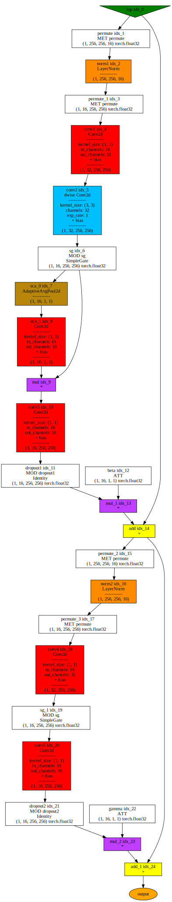

# Tracing examples


We are using the following versions:

    torch version     = 2.7.1+cu126
    pthelpers_version = 0.1.32

Let us explore the `NAFNet` model for super resolution and denoising:

- paper: [arXiv:2204.04676](https://arxiv.org/abs/2204.04676)

- code: <https://github.com/megvii-research/NAFNet>

``` python
import pthelpers

import nafnet_arch

img_channel = 3
width = 16
enc_blks = [1, 1, 1, 1]
middle_blk_num = 1
dec_blks = [1, 1, 1, 1]

model = nafnet_arch.NAFNet(
    img_channel=img_channel,
    width=width,
    middle_blk_num=middle_blk_num,
    enc_blk_nums=enc_blks,
    dec_blk_nums=dec_blks,
)
model.eval()
```

    NAFNet(
      (intro): Conv2d(3, 16, kernel_size=(3, 3), stride=(1, 1), padding=(1, 1))
      (ending): Conv2d(16, 3, kernel_size=(3, 3), stride=(1, 1), padding=(1, 1))
      (encoders): ModuleList(
        (0): Sequential(
          (0): NAFBlock(
            (conv1): Conv2d(16, 32, kernel_size=(1, 1), stride=(1, 1))
            (conv2): Conv2d(32, 32, kernel_size=(3, 3), stride=(1, 1), padding=(1, 1), groups=32)
            (conv3): Conv2d(16, 16, kernel_size=(1, 1), stride=(1, 1))
            (sca): Sequential(
              (0): AdaptiveAvgPool2d(output_size=1)
              (1): Conv2d(16, 16, kernel_size=(1, 1), stride=(1, 1))
            )
            (sg): SimpleGate()
            (conv4): Conv2d(16, 32, kernel_size=(1, 1), stride=(1, 1))
            (conv5): Conv2d(16, 16, kernel_size=(1, 1), stride=(1, 1))
            (norm1): LayerNorm((16,), eps=1e-05, elementwise_affine=True)
            (norm2): LayerNorm((16,), eps=1e-05, elementwise_affine=True)
            (dropout1): Identity()
            (dropout2): Identity()
          )
        )
        (1): Sequential(
          (0): NAFBlock(
            (conv1): Conv2d(32, 64, kernel_size=(1, 1), stride=(1, 1))
            (conv2): Conv2d(64, 64, kernel_size=(3, 3), stride=(1, 1), padding=(1, 1), groups=64)
            (conv3): Conv2d(32, 32, kernel_size=(1, 1), stride=(1, 1))
            (sca): Sequential(
              (0): AdaptiveAvgPool2d(output_size=1)
              (1): Conv2d(32, 32, kernel_size=(1, 1), stride=(1, 1))
            )
            (sg): SimpleGate()
            (conv4): Conv2d(32, 64, kernel_size=(1, 1), stride=(1, 1))
            (conv5): Conv2d(32, 32, kernel_size=(1, 1), stride=(1, 1))
            (norm1): LayerNorm((32,), eps=1e-05, elementwise_affine=True)
            (norm2): LayerNorm((32,), eps=1e-05, elementwise_affine=True)
            (dropout1): Identity()
            (dropout2): Identity()
          )
        )
        (2): Sequential(
          (0): NAFBlock(
            (conv1): Conv2d(64, 128, kernel_size=(1, 1), stride=(1, 1))
            (conv2): Conv2d(128, 128, kernel_size=(3, 3), stride=(1, 1), padding=(1, 1), groups=128)
            (conv3): Conv2d(64, 64, kernel_size=(1, 1), stride=(1, 1))
            (sca): Sequential(
              (0): AdaptiveAvgPool2d(output_size=1)
              (1): Conv2d(64, 64, kernel_size=(1, 1), stride=(1, 1))
            )
            (sg): SimpleGate()
            (conv4): Conv2d(64, 128, kernel_size=(1, 1), stride=(1, 1))
            (conv5): Conv2d(64, 64, kernel_size=(1, 1), stride=(1, 1))
            (norm1): LayerNorm((64,), eps=1e-05, elementwise_affine=True)
            (norm2): LayerNorm((64,), eps=1e-05, elementwise_affine=True)
            (dropout1): Identity()
            (dropout2): Identity()
          )
        )
        (3): Sequential(
          (0): NAFBlock(
            (conv1): Conv2d(128, 256, kernel_size=(1, 1), stride=(1, 1))
            (conv2): Conv2d(256, 256, kernel_size=(3, 3), stride=(1, 1), padding=(1, 1), groups=256)
            (conv3): Conv2d(128, 128, kernel_size=(1, 1), stride=(1, 1))
            (sca): Sequential(
              (0): AdaptiveAvgPool2d(output_size=1)
              (1): Conv2d(128, 128, kernel_size=(1, 1), stride=(1, 1))
            )
            (sg): SimpleGate()
            (conv4): Conv2d(128, 256, kernel_size=(1, 1), stride=(1, 1))
            (conv5): Conv2d(128, 128, kernel_size=(1, 1), stride=(1, 1))
            (norm1): LayerNorm((128,), eps=1e-05, elementwise_affine=True)
            (norm2): LayerNorm((128,), eps=1e-05, elementwise_affine=True)
            (dropout1): Identity()
            (dropout2): Identity()
          )
        )
      )
      (decoders): ModuleList(
        (0): Sequential(
          (0): NAFBlock(
            (conv1): Conv2d(128, 256, kernel_size=(1, 1), stride=(1, 1))
            (conv2): Conv2d(256, 256, kernel_size=(3, 3), stride=(1, 1), padding=(1, 1), groups=256)
            (conv3): Conv2d(128, 128, kernel_size=(1, 1), stride=(1, 1))
            (sca): Sequential(
              (0): AdaptiveAvgPool2d(output_size=1)
              (1): Conv2d(128, 128, kernel_size=(1, 1), stride=(1, 1))
            )
            (sg): SimpleGate()
            (conv4): Conv2d(128, 256, kernel_size=(1, 1), stride=(1, 1))
            (conv5): Conv2d(128, 128, kernel_size=(1, 1), stride=(1, 1))
            (norm1): LayerNorm((128,), eps=1e-05, elementwise_affine=True)
            (norm2): LayerNorm((128,), eps=1e-05, elementwise_affine=True)
            (dropout1): Identity()
            (dropout2): Identity()
          )
        )
        (1): Sequential(
          (0): NAFBlock(
            (conv1): Conv2d(64, 128, kernel_size=(1, 1), stride=(1, 1))
            (conv2): Conv2d(128, 128, kernel_size=(3, 3), stride=(1, 1), padding=(1, 1), groups=128)
            (conv3): Conv2d(64, 64, kernel_size=(1, 1), stride=(1, 1))
            (sca): Sequential(
              (0): AdaptiveAvgPool2d(output_size=1)
              (1): Conv2d(64, 64, kernel_size=(1, 1), stride=(1, 1))
            )
            (sg): SimpleGate()
            (conv4): Conv2d(64, 128, kernel_size=(1, 1), stride=(1, 1))
            (conv5): Conv2d(64, 64, kernel_size=(1, 1), stride=(1, 1))
            (norm1): LayerNorm((64,), eps=1e-05, elementwise_affine=True)
            (norm2): LayerNorm((64,), eps=1e-05, elementwise_affine=True)
            (dropout1): Identity()
            (dropout2): Identity()
          )
        )
        (2): Sequential(
          (0): NAFBlock(
            (conv1): Conv2d(32, 64, kernel_size=(1, 1), stride=(1, 1))
            (conv2): Conv2d(64, 64, kernel_size=(3, 3), stride=(1, 1), padding=(1, 1), groups=64)
            (conv3): Conv2d(32, 32, kernel_size=(1, 1), stride=(1, 1))
            (sca): Sequential(
              (0): AdaptiveAvgPool2d(output_size=1)
              (1): Conv2d(32, 32, kernel_size=(1, 1), stride=(1, 1))
            )
            (sg): SimpleGate()
            (conv4): Conv2d(32, 64, kernel_size=(1, 1), stride=(1, 1))
            (conv5): Conv2d(32, 32, kernel_size=(1, 1), stride=(1, 1))
            (norm1): LayerNorm((32,), eps=1e-05, elementwise_affine=True)
            (norm2): LayerNorm((32,), eps=1e-05, elementwise_affine=True)
            (dropout1): Identity()
            (dropout2): Identity()
          )
        )
        (3): Sequential(
          (0): NAFBlock(
            (conv1): Conv2d(16, 32, kernel_size=(1, 1), stride=(1, 1))
            (conv2): Conv2d(32, 32, kernel_size=(3, 3), stride=(1, 1), padding=(1, 1), groups=32)
            (conv3): Conv2d(16, 16, kernel_size=(1, 1), stride=(1, 1))
            (sca): Sequential(
              (0): AdaptiveAvgPool2d(output_size=1)
              (1): Conv2d(16, 16, kernel_size=(1, 1), stride=(1, 1))
            )
            (sg): SimpleGate()
            (conv4): Conv2d(16, 32, kernel_size=(1, 1), stride=(1, 1))
            (conv5): Conv2d(16, 16, kernel_size=(1, 1), stride=(1, 1))
            (norm1): LayerNorm((16,), eps=1e-05, elementwise_affine=True)
            (norm2): LayerNorm((16,), eps=1e-05, elementwise_affine=True)
            (dropout1): Identity()
            (dropout2): Identity()
          )
        )
      )
      (middle_blks): Sequential(
        (0): NAFBlock(
          (conv1): Conv2d(256, 512, kernel_size=(1, 1), stride=(1, 1))
          (conv2): Conv2d(512, 512, kernel_size=(3, 3), stride=(1, 1), padding=(1, 1), groups=512)
          (conv3): Conv2d(256, 256, kernel_size=(1, 1), stride=(1, 1))
          (sca): Sequential(
            (0): AdaptiveAvgPool2d(output_size=1)
            (1): Conv2d(256, 256, kernel_size=(1, 1), stride=(1, 1))
          )
          (sg): SimpleGate()
          (conv4): Conv2d(256, 512, kernel_size=(1, 1), stride=(1, 1))
          (conv5): Conv2d(256, 256, kernel_size=(1, 1), stride=(1, 1))
          (norm1): LayerNorm((256,), eps=1e-05, elementwise_affine=True)
          (norm2): LayerNorm((256,), eps=1e-05, elementwise_affine=True)
          (dropout1): Identity()
          (dropout2): Identity()
        )
      )
      (ups): ModuleList(
        (0): Sequential(
          (0): Conv2d(256, 512, kernel_size=(1, 1), stride=(1, 1), bias=False)
          (1): PixelShuffle(upscale_factor=2)
        )
        (1): Sequential(
          (0): Conv2d(128, 256, kernel_size=(1, 1), stride=(1, 1), bias=False)
          (1): PixelShuffle(upscale_factor=2)
        )
        (2): Sequential(
          (0): Conv2d(64, 128, kernel_size=(1, 1), stride=(1, 1), bias=False)
          (1): PixelShuffle(upscale_factor=2)
        )
        (3): Sequential(
          (0): Conv2d(32, 64, kernel_size=(1, 1), stride=(1, 1), bias=False)
          (1): PixelShuffle(upscale_factor=2)
        )
      )
      (downs): ModuleList(
        (0): Conv2d(16, 32, kernel_size=(2, 2), stride=(2, 2))
        (1): Conv2d(32, 64, kernel_size=(2, 2), stride=(2, 2))
        (2): Conv2d(64, 128, kernel_size=(2, 2), stride=(2, 2))
        (3): Conv2d(128, 256, kernel_size=(2, 2), stride=(2, 2))
      )
    )

The function `symbolic_trace_leaf_types` allows us for easy blacklisting
certain modules from tracing.

This can make e.g. visualizations more helpful.

``` python
NAFNET_LEAF_MODULE_TYPES = (
    nafnet_arch.LayerNorm2d,
    nafnet_arch.NAFBlock,
    nafnet_arch.SimpleGate,
)

model_fx = pthelpers.fxtracers.symbolic_trace_leaf_types(
    model,
    leaf_module_types=NAFNET_LEAF_MODULE_TYPES,
)

pthelpers.vis.vis_module(model_fx, input_shapes=[(1, 3, 256, 256)])
```


We can also have a look at the individual `NAFBlock`.

``` python
model.encoders[0][0]
```

    NAFBlock(
      (conv1): Conv2d(16, 32, kernel_size=(1, 1), stride=(1, 1))
      (conv2): Conv2d(32, 32, kernel_size=(3, 3), stride=(1, 1), padding=(1, 1), groups=32)
      (conv3): Conv2d(16, 16, kernel_size=(1, 1), stride=(1, 1))
      (sca): Sequential(
        (0): AdaptiveAvgPool2d(output_size=1)
        (1): Conv2d(16, 16, kernel_size=(1, 1), stride=(1, 1))
      )
      (sg): SimpleGate()
      (conv4): Conv2d(16, 32, kernel_size=(1, 1), stride=(1, 1))
      (conv5): Conv2d(16, 16, kernel_size=(1, 1), stride=(1, 1))
      (norm1): LayerNorm((16,), eps=1e-05, elementwise_affine=True)
      (norm2): LayerNorm((16,), eps=1e-05, elementwise_affine=True)
      (dropout1): Identity()
      (dropout2): Identity()
    )

``` python
block_fx = pthelpers.fxtracers.symbolic_trace_leaf_types(
    model.encoders[0][0],
    leaf_module_types=NAFNET_LEAF_MODULE_TYPES,
)

pthelpers.vis.vis_module(block_fx, input_shapes=[(1, 16, 256, 256)])
```



``` python
class MermaidGraph:
    def _repr_markdown_(self):
        s = """```mermaid
graph LR;
    A--> B & C & D;
    B--> A & E;
    C--> A & E;
    D--> A & E;
    E--> B & C & D;
```"""
        return s
```

``` python
MermaidGraph()
```


