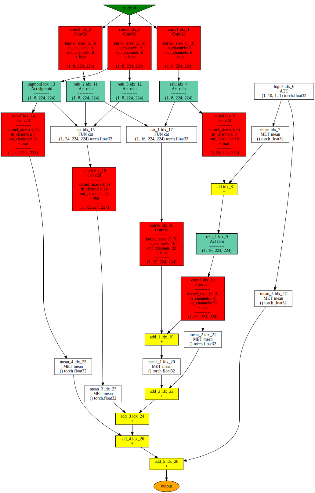

# Network visualization example


We are using the following versions:

    torch version     = 2.7.1+cu126
    pthelpers_version = 0.1.32

``` python
import torch
import pthelpers


class SampleNet1(torch.nn.Module):
    def __init__(self):
        super().__init__()
        self.conv1 = torch.nn.Conv2d(
            in_channels=3, out_channels=8, kernel_size=3, padding="same"
        )
        self.conv2 = torch.nn.Conv2d(
            in_channels=3, out_channels=8, kernel_size=3, padding="same"
        )
        self.conv3 = torch.nn.Conv2d(
            in_channels=3, out_channels=8, kernel_size=3, padding="same"
        )
        self.conv4 = torch.nn.Conv2d(
            in_channels=8, out_channels=16, kernel_size=3, padding="same"
        )
        self.conv5 = torch.nn.Conv2d(
            in_channels=16, out_channels=32, kernel_size=3, padding="same"
        )
        self.conv6 = torch.nn.Conv2d(
            in_channels=24, out_channels=32, kernel_size=3, padding="same"
        )
        self.conv7 = torch.nn.Conv2d(
            in_channels=8, out_channels=32, kernel_size=3, padding="same"
        )
        self.conv8 = torch.nn.Conv2d(
            in_channels=16, out_channels=32, kernel_size=3, padding="same"
        )
        self.logits = torch.nn.Parameter(torch.empty((1, 10, 1, 1)))
        torch.nn.init.constant_(self.logits, 1.0)

    def forward(self, x):
        x_conv1 = self.conv1(x)
        x_conv2 = self.conv2(x)
        x_conv3 = self.conv3(x)
        x_act_conv1 = torch.nn.functional.relu(x_conv1)
        x_conv4 = self.conv4(x_act_conv1) + self.logits.mean()
        x_act_conv4 = torch.nn.functional.relu(x_conv4)
        x_conv5 = self.conv5(x_act_conv4)
        x_act_conv2 = torch.nn.functional.relu(x_conv2)
        x_act1_conv3 = torch.nn.functional.relu(x_conv3)
        x_act2_conv3 = torch.sigmoid(x_conv3)
        x_conv7 = self.conv7(x_act2_conv3)
        x_concat1 = torch.cat([x_act_conv2, x_act1_conv3, x_act2_conv3], dim=1)
        x_conv6 = self.conv6(x_concat1)
        x_concat2 = torch.cat([x_act_conv1, x_act_conv2], dim=1)
        x_conv8 = self.conv8(x_concat2)
        x_sum1 = x_conv5 + x_conv8
        return (
            x_sum1.mean()
            + x_conv5.mean()
            + x_conv6.mean()
            + x_conv7.mean()
            + self.logits.mean()
        )
```

``` python
nn = SampleNet1()

pthelpers.vis.vis_module(nn, input_shapes=[(1, 3, 224, 224)])
```


