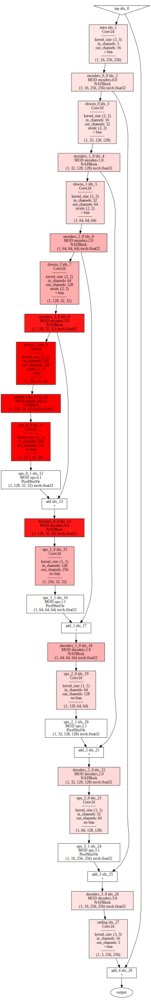
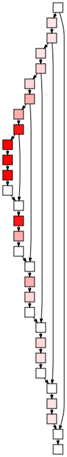
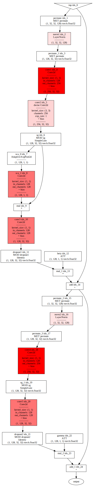
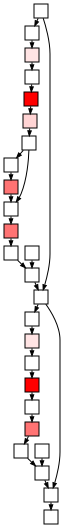

# Advanced visualzation


We are using the following versions:

    torch version     = 2.7.1+cu126
    pthelpers_version = 0.1.32

Let us create our test model:

``` python
import torch
import pthelpers
import nafnet_arch

img_channel = 3
width = 16
enc_blks = [1, 1, 1, 1]
middle_blk_num = 1
dec_blks = [1, 1, 1, 1]

model = nafnet_arch.NAFNet(
    img_channel=img_channel,
    width=width,
    middle_blk_num=middle_blk_num,
    enc_blk_nums=enc_blks,
    dec_blk_nums=dec_blks,
)
model.eval()
```

    NAFNet(
      (intro): Conv2d(3, 16, kernel_size=(3, 3), stride=(1, 1), padding=(1, 1))
      (ending): Conv2d(16, 3, kernel_size=(3, 3), stride=(1, 1), padding=(1, 1))
      (encoders): ModuleList(
        (0): Sequential(
          (0): NAFBlock(
            (conv1): Conv2d(16, 32, kernel_size=(1, 1), stride=(1, 1))
            (conv2): Conv2d(32, 32, kernel_size=(3, 3), stride=(1, 1), padding=(1, 1), groups=32)
            (conv3): Conv2d(16, 16, kernel_size=(1, 1), stride=(1, 1))
            (sca): Sequential(
              (0): AdaptiveAvgPool2d(output_size=1)
              (1): Conv2d(16, 16, kernel_size=(1, 1), stride=(1, 1))
            )
            (sg): SimpleGate()
            (conv4): Conv2d(16, 32, kernel_size=(1, 1), stride=(1, 1))
            (conv5): Conv2d(16, 16, kernel_size=(1, 1), stride=(1, 1))
            (norm1): LayerNorm((16,), eps=1e-05, elementwise_affine=True)
            (norm2): LayerNorm((16,), eps=1e-05, elementwise_affine=True)
            (dropout1): Identity()
            (dropout2): Identity()
          )
        )
        (1): Sequential(
          (0): NAFBlock(
            (conv1): Conv2d(32, 64, kernel_size=(1, 1), stride=(1, 1))
            (conv2): Conv2d(64, 64, kernel_size=(3, 3), stride=(1, 1), padding=(1, 1), groups=64)
            (conv3): Conv2d(32, 32, kernel_size=(1, 1), stride=(1, 1))
            (sca): Sequential(
              (0): AdaptiveAvgPool2d(output_size=1)
              (1): Conv2d(32, 32, kernel_size=(1, 1), stride=(1, 1))
            )
            (sg): SimpleGate()
            (conv4): Conv2d(32, 64, kernel_size=(1, 1), stride=(1, 1))
            (conv5): Conv2d(32, 32, kernel_size=(1, 1), stride=(1, 1))
            (norm1): LayerNorm((32,), eps=1e-05, elementwise_affine=True)
            (norm2): LayerNorm((32,), eps=1e-05, elementwise_affine=True)
            (dropout1): Identity()
            (dropout2): Identity()
          )
        )
        (2): Sequential(
          (0): NAFBlock(
            (conv1): Conv2d(64, 128, kernel_size=(1, 1), stride=(1, 1))
            (conv2): Conv2d(128, 128, kernel_size=(3, 3), stride=(1, 1), padding=(1, 1), groups=128)
            (conv3): Conv2d(64, 64, kernel_size=(1, 1), stride=(1, 1))
            (sca): Sequential(
              (0): AdaptiveAvgPool2d(output_size=1)
              (1): Conv2d(64, 64, kernel_size=(1, 1), stride=(1, 1))
            )
            (sg): SimpleGate()
            (conv4): Conv2d(64, 128, kernel_size=(1, 1), stride=(1, 1))
            (conv5): Conv2d(64, 64, kernel_size=(1, 1), stride=(1, 1))
            (norm1): LayerNorm((64,), eps=1e-05, elementwise_affine=True)
            (norm2): LayerNorm((64,), eps=1e-05, elementwise_affine=True)
            (dropout1): Identity()
            (dropout2): Identity()
          )
        )
        (3): Sequential(
          (0): NAFBlock(
            (conv1): Conv2d(128, 256, kernel_size=(1, 1), stride=(1, 1))
            (conv2): Conv2d(256, 256, kernel_size=(3, 3), stride=(1, 1), padding=(1, 1), groups=256)
            (conv3): Conv2d(128, 128, kernel_size=(1, 1), stride=(1, 1))
            (sca): Sequential(
              (0): AdaptiveAvgPool2d(output_size=1)
              (1): Conv2d(128, 128, kernel_size=(1, 1), stride=(1, 1))
            )
            (sg): SimpleGate()
            (conv4): Conv2d(128, 256, kernel_size=(1, 1), stride=(1, 1))
            (conv5): Conv2d(128, 128, kernel_size=(1, 1), stride=(1, 1))
            (norm1): LayerNorm((128,), eps=1e-05, elementwise_affine=True)
            (norm2): LayerNorm((128,), eps=1e-05, elementwise_affine=True)
            (dropout1): Identity()
            (dropout2): Identity()
          )
        )
      )
      (decoders): ModuleList(
        (0): Sequential(
          (0): NAFBlock(
            (conv1): Conv2d(128, 256, kernel_size=(1, 1), stride=(1, 1))
            (conv2): Conv2d(256, 256, kernel_size=(3, 3), stride=(1, 1), padding=(1, 1), groups=256)
            (conv3): Conv2d(128, 128, kernel_size=(1, 1), stride=(1, 1))
            (sca): Sequential(
              (0): AdaptiveAvgPool2d(output_size=1)
              (1): Conv2d(128, 128, kernel_size=(1, 1), stride=(1, 1))
            )
            (sg): SimpleGate()
            (conv4): Conv2d(128, 256, kernel_size=(1, 1), stride=(1, 1))
            (conv5): Conv2d(128, 128, kernel_size=(1, 1), stride=(1, 1))
            (norm1): LayerNorm((128,), eps=1e-05, elementwise_affine=True)
            (norm2): LayerNorm((128,), eps=1e-05, elementwise_affine=True)
            (dropout1): Identity()
            (dropout2): Identity()
          )
        )
        (1): Sequential(
          (0): NAFBlock(
            (conv1): Conv2d(64, 128, kernel_size=(1, 1), stride=(1, 1))
            (conv2): Conv2d(128, 128, kernel_size=(3, 3), stride=(1, 1), padding=(1, 1), groups=128)
            (conv3): Conv2d(64, 64, kernel_size=(1, 1), stride=(1, 1))
            (sca): Sequential(
              (0): AdaptiveAvgPool2d(output_size=1)
              (1): Conv2d(64, 64, kernel_size=(1, 1), stride=(1, 1))
            )
            (sg): SimpleGate()
            (conv4): Conv2d(64, 128, kernel_size=(1, 1), stride=(1, 1))
            (conv5): Conv2d(64, 64, kernel_size=(1, 1), stride=(1, 1))
            (norm1): LayerNorm((64,), eps=1e-05, elementwise_affine=True)
            (norm2): LayerNorm((64,), eps=1e-05, elementwise_affine=True)
            (dropout1): Identity()
            (dropout2): Identity()
          )
        )
        (2): Sequential(
          (0): NAFBlock(
            (conv1): Conv2d(32, 64, kernel_size=(1, 1), stride=(1, 1))
            (conv2): Conv2d(64, 64, kernel_size=(3, 3), stride=(1, 1), padding=(1, 1), groups=64)
            (conv3): Conv2d(32, 32, kernel_size=(1, 1), stride=(1, 1))
            (sca): Sequential(
              (0): AdaptiveAvgPool2d(output_size=1)
              (1): Conv2d(32, 32, kernel_size=(1, 1), stride=(1, 1))
            )
            (sg): SimpleGate()
            (conv4): Conv2d(32, 64, kernel_size=(1, 1), stride=(1, 1))
            (conv5): Conv2d(32, 32, kernel_size=(1, 1), stride=(1, 1))
            (norm1): LayerNorm((32,), eps=1e-05, elementwise_affine=True)
            (norm2): LayerNorm((32,), eps=1e-05, elementwise_affine=True)
            (dropout1): Identity()
            (dropout2): Identity()
          )
        )
        (3): Sequential(
          (0): NAFBlock(
            (conv1): Conv2d(16, 32, kernel_size=(1, 1), stride=(1, 1))
            (conv2): Conv2d(32, 32, kernel_size=(3, 3), stride=(1, 1), padding=(1, 1), groups=32)
            (conv3): Conv2d(16, 16, kernel_size=(1, 1), stride=(1, 1))
            (sca): Sequential(
              (0): AdaptiveAvgPool2d(output_size=1)
              (1): Conv2d(16, 16, kernel_size=(1, 1), stride=(1, 1))
            )
            (sg): SimpleGate()
            (conv4): Conv2d(16, 32, kernel_size=(1, 1), stride=(1, 1))
            (conv5): Conv2d(16, 16, kernel_size=(1, 1), stride=(1, 1))
            (norm1): LayerNorm((16,), eps=1e-05, elementwise_affine=True)
            (norm2): LayerNorm((16,), eps=1e-05, elementwise_affine=True)
            (dropout1): Identity()
            (dropout2): Identity()
          )
        )
      )
      (middle_blks): Sequential(
        (0): NAFBlock(
          (conv1): Conv2d(256, 512, kernel_size=(1, 1), stride=(1, 1))
          (conv2): Conv2d(512, 512, kernel_size=(3, 3), stride=(1, 1), padding=(1, 1), groups=512)
          (conv3): Conv2d(256, 256, kernel_size=(1, 1), stride=(1, 1))
          (sca): Sequential(
            (0): AdaptiveAvgPool2d(output_size=1)
            (1): Conv2d(256, 256, kernel_size=(1, 1), stride=(1, 1))
          )
          (sg): SimpleGate()
          (conv4): Conv2d(256, 512, kernel_size=(1, 1), stride=(1, 1))
          (conv5): Conv2d(256, 256, kernel_size=(1, 1), stride=(1, 1))
          (norm1): LayerNorm((256,), eps=1e-05, elementwise_affine=True)
          (norm2): LayerNorm((256,), eps=1e-05, elementwise_affine=True)
          (dropout1): Identity()
          (dropout2): Identity()
        )
      )
      (ups): ModuleList(
        (0): Sequential(
          (0): Conv2d(256, 512, kernel_size=(1, 1), stride=(1, 1), bias=False)
          (1): PixelShuffle(upscale_factor=2)
        )
        (1): Sequential(
          (0): Conv2d(128, 256, kernel_size=(1, 1), stride=(1, 1), bias=False)
          (1): PixelShuffle(upscale_factor=2)
        )
        (2): Sequential(
          (0): Conv2d(64, 128, kernel_size=(1, 1), stride=(1, 1), bias=False)
          (1): PixelShuffle(upscale_factor=2)
        )
        (3): Sequential(
          (0): Conv2d(32, 64, kernel_size=(1, 1), stride=(1, 1), bias=False)
          (1): PixelShuffle(upscale_factor=2)
        )
      )
      (downs): ModuleList(
        (0): Conv2d(16, 32, kernel_size=(2, 2), stride=(2, 2))
        (1): Conv2d(32, 64, kernel_size=(2, 2), stride=(2, 2))
        (2): Conv2d(64, 128, kernel_size=(2, 2), stride=(2, 2))
        (3): Conv2d(128, 256, kernel_size=(2, 2), stride=(2, 2))
      )
    )

Create style coloring by number of params:

``` python
def _get_num_params(module):
    return sum(dict((p.data_ptr(), p.numel()) for p in module.parameters()).values())


def get_max_params(m):
    m_traced = torch.fx.symbolic_trace(m)
    module_dict = dict(m_traced.named_modules())
    max_num_params = -1
    for node in m_traced.graph.nodes:
        if node.op == "call_module":
            module = module_dict[node.target]
            num_params = _get_num_params(module)
            if num_params > max_num_params:
                max_num_params = num_params
    return max_num_params


def _get_color(x):
    x = max(min(1.0, x), 0.0)
    if x > 1.0e-6:
        res = "#"
        min_color = [255.0, 230.0, 230.0]
        max_color = [255.0, 0.0, 0.0]
        for minc, maxc in zip(min_color, max_color):
            c = round(minc + x * (maxc - minc))
            res += f"{c:02X}"
        return res
    else:
        return "#ffffff"


def make_num_params_style_mini_fn(scale):
    def __get_style(*, element, node_meta1=None, node_meta2=None, module_dict=None):
        style = pthelpers.vis.get_std_min_style(
            element=element,
            node_meta1=node_meta1,
            node_meta2=node_meta1,
            module_dict=module_dict,
        )
        if element == "node":
            node = node_meta1["node"]
            if node.op == "call_module":
                module = module_dict[node.target]
                num_params = _get_num_params(module)
                old_tooltip = style["tooltip"]
                style["tooltip"] = f"#p={num_params}\n\n" + old_tooltip
                style["fillcolor"] = _get_color(num_params / scale)
            else:
                old_tooltip = style["tooltip"]
                style["tooltip"] = "#p=0\n\n" + old_tooltip
                style["fillcolor"] = _get_color(0.0)
        return style

    return __get_style


def make_num_params_style_fn(scale):
    def __get_style(*, element, node_meta1=None, node_meta2=None, module_dict=None):
        style = pthelpers.vis.get_std_style(
            element=element,
            node_meta1=node_meta1,
            node_meta2=node_meta1,
            module_dict=module_dict,
        )
        if element == "node":
            node = node_meta1["node"]
            if node.op == "call_module":
                module = module_dict[node.target]
                num_params = _get_num_params(module)
                style["fillcolor"] = _get_color(num_params / scale)
            else:
                style["fillcolor"] = _get_color(0.0)
        return style

    return __get_style
```

``` python
NAFNET_LEAF_MODULE_TYPES = (
    nafnet_arch.NAFBlock,
    nafnet_arch.SimpleGate,
)
NAFNET_TOT_PARAMS = get_max_params(model)

model_fx = pthelpers.fxtracers.symbolic_trace_leaf_types(
    model,
    leaf_module_types=NAFNET_LEAF_MODULE_TYPES,
)

pthelpers.vis.vis_module(
    model_fx,
    input_shapes=(1,3,256,256),
    get_style_fn=make_num_params_style_fn(NAFNET_TOT_PARAMS),
)
```



``` python
pthelpers.vis.vis_module(model_fx, input_shapes=(1, 3, 256, 256), get_style_fn=make_num_params_style_mini_fn(NAFNET_TOT_PARAMS))
```



``` python
block_fx = pthelpers.fxtracers.symbolic_trace_leaf_types(
    model.encoders[3][0],
    leaf_module_types=NAFNET_LEAF_MODULE_TYPES,
)

BLOCK_TOT_PARAMS = get_max_params(block_fx)

pthelpers.vis.vis_module(block_fx, input_shapes=(1, 128, 32, 32), get_style_fn=make_num_params_style_fn(BLOCK_TOT_PARAMS))
```



``` python
pthelpers.vis.vis_module(block_fx, input_shapes=(1, 128, 32, 32), get_style_fn=make_num_params_style_mini_fn(BLOCK_TOT_PARAMS))
```


